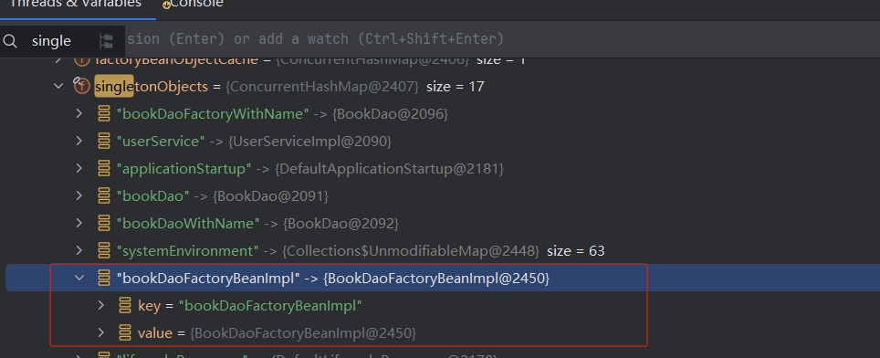
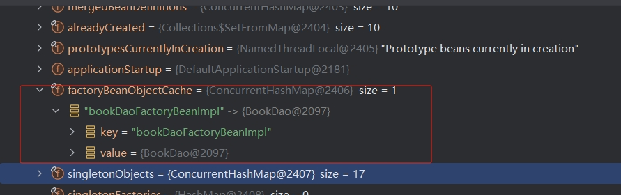

[toc]

# BeanFactory

## BeanFactory 项目配置流程

> step1 创建 maven 项目导入 spring 坐标，并同步项目

```xml
<dependencies>
    <!--
        导入 spring-context 包
        spring-context 会自动依赖导入 spring-aop, spring-beans, spring-core
    -->
    <dependency>
        <groupId>org.springframework</groupId>
        <artifactId>spring-context</artifactId>
        <version>5.3.24</version>
    </dependency>
</dependencies>
```

> step2 定义对应的 bean 类

```java
// userDao
public class UserDao { }

// IUserService
public interface IUserService { }

// UserServiceImpl
public class UserServiceImpl implements IUserService { 
    private UserDao userDao;
    
    // beans.xml 中配置的 userDao 属性映射到该 get 函数，通过该函数注入 userDao 对象
    public void setUserDao(UserDao userDao) {
        this.userDao = userDao;
    }
}
```

> step3 创建 `beans.xml` 配置文件，配置 bean 信息

```xml
<?xml version="1.0" encoding="UTF-8"?>
<beans xmlns="http://www.springframework.org/schema/beans"
       xmlns:xsi="http://www.w3.org/2001/XMLSchema-instance"
       xsi:schemaLocation="http://www.springframework.org/schema/beans http://www.springframework.org/schema/beans/spring-beans.xsd">

    <!-- 配置 spring bean 对象和依赖关系 -->
    <bean name="userService" class="com.example.service.impl.UserServiceImpl">
        <!--
            注入 userDao 对象，
            name="userDao" 表示名为 userDao 的 spring bean
            ref="userDao" 表示向 userService 对象中注入名为 userDao 的属性，即调用 serUserDao() 函数注入对象
        -->
        <property name="userDao" ref="userDao"/>
    </bean>

    <bean name="userDao" class="com.example.dao.UserDao"/>

</beans>
```

> step4 测试 BeanFactory 获取 bean 对象

```java
// 1. 创建工厂对象
DefaultListableBeanFactory factory = new DefaultListableBeanFactory();
// 2. 创建bean对象解析器 (xml解析)
XmlBeanDefinitionReader reader = new XmlBeanDefinitionReader(factory);
// 3. 绑定解析器
reader.loadBeanDefinitions("beans.xml");
// 4. 根据 id 获取bean对象
UserDao userDao = (UserDao) factory.getBean("userDao");
System.out.println("BeanFactoryCaseTest: getUserDaoBean(), userDao=" + userDao.hashCode());
// 默认情况下，beanFactory 返回的 bean 对象是单例对象，这里再次获取到的对象和上面的一致
UserDao userDao2 = (UserDao) factory.getBean("userDao");
System.out.println("BeanFactoryCaseTest: getUserDaoBean(), userDao2=" + userDao2.hashCode());
```

得到输出日志如下
```
UserDao: 1219161283
BeanFactoryCaseTest: getUserDaoBean(), userDao=1219161283
BeanFactoryCaseTest: getUserDaoBean(), userDao2=1219161283

UserServiceImpl: 1781071780
UserDao: 1667148529
UserServiceImpl: setUserDao(), userDao=1667148529
BeanFactoryCaseTest: getUserService(), userService=1781071780
BeanFactoryCaseTest: getUserService(), userService.userDao=1667148529
```

## ApplicationContext 获取 bean 对象

`ApplicationContext` 称之为 Spring 容器，内部封装了 `BeanFactory`， 比 `BeanFactory` 功能更加丰富，使用 `ApplicationContext` 进行开发时，`xml` 配置文件的名称习惯写成 `applicationContext.xml`。

> step1 将配置文件 `beans.xml 拷贝一份为 `applicationContext.xml`，xml 内容无需改动 (非必须)

> step2 使用 `ApplicationContext` 容器对象获取 bean

```java
// 通常将 applicationContext 容器对应的配置文件名称设置为 applicationContext.xml
ApplicationContext applicationContext = new ClassPathXmlApplicationContext("applicationContext.xml");

// 通过 spring 容器获取bean对象
IUserService userService = applicationContext.getBean(UserServiceImpl.class);
System.out.println("ApplicationContextCaseTest: userService=" + userService);
```

> `ApplicationContext` 与 `BeanFactory` 的关系

1. `BeanFactory` 是 Spring 的早期接口，称之为 `Spring` 的 `Bean工厂`， `ApplicationContext` 是后期更高级的接口，称之为 `Spring容器`;
2. `ApplicationContext` 在 `BeanFactory` 的基础上对功能进行了扩展，例如: 监听功能、国际化功能等。`BeanFactory` 的 api 更偏向底层，`ApplicationContext` 的 api 大多数是对这些底层 api 的封装;
3. `Bean` 创建的主要逻辑和功能都被封装在 `BeanFactory` 中，`ApplicationContext` 不仅继承了 `BeanFactory`，而且内部还维护着 `BeanFactory` 的引用，所以 `ApplicationContext` 和 `BeanFactory` 既有继承关系，又有融合关系;
4. `Bean` 的初始化时机不同
   - 原始的 `BeanFactory` 是在首次调用 `getBean()` 时才进行 `Bean` 的创建;
   - `ApplicationContext` 是配置文件加载，容器一创建就将 `Bean` 都实例化并初始化完成;

目录结构如下
```text
│  pom.xml
├─src
│  ├─main
│  │  ├─java
│  │  │  └─com
│  │  │      └─example
│  │  │          │  ApplicationContextCaseTest.java
│  │  │          │  BeanFactoryCaseTest.java
│  │  │          │
│  │  │          ├─dao
│  │  │          │      UserDao.java
│  │  │          │
│  │  │          └─service
│  │  │              │  IUserService.java
│  │  │              │
│  │  │              └─impl
│  │  │                      UserServiceImpl.java
│  │  │
│  │  └─resources
│  │          applicationContext.xml
│  │          beans.xml
│  │
│  └─test
│      └─java
└─target
```

## 常用的 `ApplicationContext`

常用的 `ApplicationContext` 对象如下

| 实现类                                  | 描述                                    |
|--------------------------------------|---------------------------------------|
| `ClassPathXmlApplicationContext`     | 加载类路径下的 xml 配置的 `ApplicationContext`  |
| `FileSystemXmlApplicationContext`    | 加载磁盘路径下的 xml 配置的 `ApplicationContext` |
| `AnnotationConfigApplicationContext` | 加载注解配置类的 `ApplicationContext`         |

在 `Spring Web` 环境下，常用的两个 `ApplicationContext` 如下

| 实现类                                     | 描述                                    |
|-----------------------------------------|---------------------------------------|
| `XmlWebApplicationContext`              | web 环境下，加载类路径下的 xml 配置的 `Application` |
| `AnnotationConfigWebApplicationContext` | web 环境下，加载注解配置类的 `ApplicationContext` |

# Spring Bean 的配置详解

Spring 开发中有很多 Bean 的配置，常用的 Bean 配置如下

| xm l配置属性                                     | 作用                                                           |
|----------------------------------------------|--------------------------------------------------------------|
| `<bean id="" class=""/>`                     | `Bean` 的 `id` 和 全限定名配置                                       |
| `<bean name="" />`                           | 设置 `Bean` 的别名，通过别名也能直接获取到 `Bean` 实例                          |
| `<bean scope="" />`                          | `Bean` 的作用范围，`BeanFactory` 作为容器时取值 `singleton` 和 `prototype` |
| `<bean lazy-init="" />`                      | `Bean` 的实例化时机 ( 是否延迟加载 )，`BeanFactory` 作为容器时无效               |
| `<bean init-method="" />`                    | `Bean` 实例化后自动执行的初始化方法， `method` 指定方法名                        |
| `<bean destroy-method="" />`                 | `Bean` 实例销毁前执行的方法，`method` 指定方法名                             |
| `<bean autowire="byType" />`                 | 设置自动注入模式，常用的有按照类型 `byType`，按照名字 `byName`                     |
| `<bean factory-bean="" factory-method="" />` | 指定哪个工厂 `Bean` 的哪个方法完成 `Bean` 的创建                             |

## `<bean id="" class=""/>`

配置 `UserDao` 由 Spring 容器负责管理

```xml
<bean id="userDao" class="com.example.dao.UserDao" />
```

通过上述配置，由 Spring 容器创建的 `UserDao` 实例会被存储到 Spring 容器 ( `singleObjects` 单例池，map结构)，此时存储 `UserDao` 的 `key` ( 即: `beanName` ) 为配置文件中过的 `id` 字段，`value` 值为 `UserDao` 对象。

```java
// 获取 bean 对象
applicationContext.getBean("userDao");
```

> 注: 如果不配置 id 字段，则 spring 会将当前 Bean 实例的全限定名作为 `beanName`

```xml
<!-- 不配置 id 属性 -->
<bean class="com.example.dao.UserDao" />
```

此时 spring 容器会将全限定名 ( `class` ) 作为 `bean` 的 `beanName`，此时通过 spring 容器获取 `bean` 实例如下

```java
// 未配置 id 属性时，通过全限定名获取 bean 对象
applicationContext.getBean("com.example.dao.UserDao");
```


## `<bean name="" />` bean 的别名配置

`BeanFactory` 内部会维护一个 `aliasMap` 对象映射 `name` ( key ) 和 `id` ( value );

如果未配置 `id` 属性，配置了 `name` 别名时，此时 `singleObjects` 中会取第一个别名作为 `key` 存储，剩下的 `name` 会存储到 `aliasMap` 中;

```xml
<!-- 为 UserDao bean 对象配置别名 -->
<bean id="userDao" name="abc" class="com.example.dao.UserDao" />

<!-- 为 UserDao bean 对象配置多个别名 -->
<bean id="userDao" name="abc,def" class="com.example.dao.UserDao" />
```

通过别名获取 bean 对象
```java
// 通过id获取 bean
applicationContext.getBean("userDao");

// 通过别名获取Bean
applicationContext.getBean("abc");
applicationContext.getBean("def");
```


## `<bean scope="" />` bean的作用范围

默认情况下，单纯的 spring 环境 bean 作用范围有两个: `singleton` 和 `prototype`

- `singleton`: 单例 ( 默认值 )，Spring 容器创建的时候，就会对 bean 进行实例化，并存储到容器内部的单例池中 ( `ConcurrentHashMap singletonObjects` )，后续从 bean 容器中获取 bean 时 ( `getBean()` )，都是从单例池中获取相同的 bean 对象;
- `prototype`: 原型，Spring 容器初始化的时候不会创建 bean 实例， 当调用 `getBean()` 时才会实例化 bean ，每次 `getBean()` 都会创建一个新的 bean 实例;

```xml
<!-- singleton，容器初始化时，创建bean实例，维护在容器的单例池中 -->
<bean id="userDao" class="com.example.dao.UserDao" scope="singleton"/>

<!-- prototype，在容器获取 bean 时，实例化 bean，每次获取的都是一个新的 bean 实例 -->
<bean id="userService" class="com.example.service.impl.UserServiceImpl" scope="prototype"/>
```

获取 bean 对象

```java
import com.example.service.impl.UserServiceImpl;

UserDao userDao1 = applicationContext.getBean("userDao");
UserDao userDao2 = applicationContext.getBean("userDao");
// userDao1 = userDao2
// UserDao 的 scope 为 singleton ，每次 getBean 获取的 bean 实例为同一个

UserServiceImpl userService1 = applicationContext.getBean("userService");
UserServiceImpl userService2 = applicationContext.getBean("userService");
// userService1 != userService2
// UserServiceImpl 的 scope 为 prototype，每次 getBean 都会重新创建一个 bean 实例
```

## `<bean lazy-init="" />` bean 的延迟加载

scope 为 `singleton` 的 bean 在 spring 容器初始化的时候就会被实例化，然后存储到 `singletonObjects` 单例池中。如果想延迟加载 bean 实例，可以通过设置 `lazy-init` 属性，当 `lazy-init=true` 时，spring 容器会在首次获取该 bean 实例的时候实例化该 `bean`，同样该实例也会被存储到 `singletonObjects` 单例池中。

```xml
<!-- 配置 userDao bean延迟加载 -->
<bean id="userDao" class="com.example.dao.UserDao" lazy-init="true" />
```

## `<bean init-method="" />` 和 `<bean destroy-method="" />` bean 的初始化和销毁方法

Bean 在被实例化后，可以执行指定的初始化方法完成相关的初始化操作，Bean 在销毁之前也可以执行指定的销毁方法，完成一些回收资源的操作;

```xml
<!-- 在 bean 配置中，配置 init-method 和 destroy-method -->
<bean name="userDao" class="com.example.dao.UserDao" init-method="postInit" destroy-method="preDestroy"/>
```

在 UserDao 对象实例化后，会自动执行 `postInit()` 函数，在 UserDao 对象销毁之前执行 `preDestroy()`;

注意: `destroy-method` 不是一定会执行的，如果容器在还未执行到销毁方法回调之前中断了，则 `destroy-method` 就不会被触发了.

```java
public class UserDao {
    public UserDao() {
        System.out.println("UserDao: " + this.hashCode());
    }
    public void postInit() {
        System.out.println("UserDao: postInit(), " + this.hashCode());
    }
    public void preDestroy() {
        System.out.println("UserDao: preDestroy(), " + this.hashCode());
    }
}
```

## `<bean autowire="byType" />` 自动装配

项目中的 Bean 数量较多且依赖关系复杂时，手动配置每个 Bean 的依赖关系会变得非常繁琐，通过自动装配可以减少配置文件的复杂工作。

> step1: 创建两个 bean 类

// EmpDao.java
```java
public class EmpDao {
    public void save() {
        System.out.println("EmpDao: save()");
    }
}
```

// EmpService.java
```java
public class EmpService {
    private EmpDao empDao;

    // 需要有 set 函数
    public void setEmpDao(EmpDao empDao) {
        this.empDao = empDao;
    }

    public void save() {
        empDao.save();
    }
}
```

> step2: 配置bean，并开启自动装配


## bean 的实例化配置

spring 的实例化方式主要有如下两种:

- 构造方式实例化: 底层通过构造方法对 bean 进行实例化
- 工厂方式实例化: 底层通过调用工厂方法对 bean 进行实例化

### 构造方式实例化

构造方式实例化 bean 分为 无参构造方法实例化 和 有参构造方法实例化。

> step1 配置 BookDao，包含有参构造和无参构造

```java
public class BookDao {
   public BookDao() {
      System.out.println("BookDao: 无参构造...");
   }
   public BookDao(String name) {
      System.out.println("BookDao: 有参构造，name=" + name);
   }
}
```

> step2 配置 bean 实例化方法

```xml
 <!-- 无参构造方式创建 bean -->
 <bean id="bookDao" class="com.example.dao.BookDao"/>

 <!-- 有参构造方式创建 bean -->
 <bean id="bookDaoWithName" class="com.example.dao.BookDao">
     <!-- 配置构造函数中 name 参数 -->
     <constructor-arg name="name" value="Thinking in java"/>
 </bean>
```

> step3 通过 spring 容器分别获取有参构造实例和无参构造实例

```java
BookDao bookDao1 = (BookDao) applicationContext.getBean("bookDao");
BookDao bookDao2 = (BookDao) applicationContext.getBean("bookDaoWithName");
System.out.println("ApplicationContextCaseTest: bookDao1=" + bookDao1 + ", bookDao2=" + bookDao2);

// 输出如下
/*
BookDao: 无参构造...
BookDao: 有参构造，name=Thinking in java
ApplicationContextCaseTest: bookDao1=com.example.dao.BookDao@a2431d0, bookDao2=com.example.dao.BookDao@1cbb87f3
*/
```

### 工厂方式实例化

工厂方式实例化 bean 有如下三种方式:

1. 静态工厂方法实例化 Bean;
2. 实例工厂方法实例化 Bean;
3. 实现 `FactoryBean` 规范实例化 Bean;

#### 静态工厂方法实例化 Bean

静态工厂方法实例化 Bean，通过定义一个工厂类，其内部提供一个静态方法生产 Bean 实例，然后将该工厂类和实例化 bean 的静态函数配置到 spring 容器中。

> step1 创建一个工厂类，然后提供一个静态方法获取 Bean

```java
// 创建一个工厂类
public class BookDaoFactoryBean {
   // 提供一个静态函数获取 Bean，无参构造方式
   public static BookDao getBookDaoWithStatic() {
      System.out.println("BookDaoFactoryBean: getUserDaoWithStatic, 无参构造方式");
      // 这里可以实现自定义逻辑
      return new BookDao();
   }

   // 提供一个静态函数获取 Bean，有参构造方式
   public static BookDao getBookDaoWithStatic(String name) {
      System.out.println("BookDaoFactoryBean: getUserDaoWithStatic(), name=" + name);
      return new BookDao(name);
   }
}
```

> 在 spring 容器中配置工厂类和实例化方法

注意: `constructor-arg` 标签不仅仅是为构造方法传递参数，只要是为了实例化对象而传递的参数都可以通过 `constructor-arg` 标签完成，例如下面通过静态工厂方法实例化时，也可以通过 `constructor-arg` 标签传递参数;

```xml
<!-- 配置 BookDao bean 实例的获取方式，通过 静态工厂方法 调用无参构造方式，实例化 BookDao-->
<bean id="bookDaoWithStatic" class="com.example.factory.BookDaoFactoryBean" factory-method="getBookDaoWithStatic"/>

<!-- 配置 BookDao bean 实例的获取方式，通过 静态工厂方法 调用有参构造方式，实例化 BookDao-->
<bean id="bookDaoWithStaticName" class="com.example.factory.BookDaoFactoryBean" factory-method="getBookDaoWithStatic">
    <constructor-arg name="name" value="Think in java"/>
</bean>
```

> step3 获取静态工厂方法实例化的 bean

```java
BookDao bookDao3 = (BookDao) applicationContext.getBean("bookDaoWithStatic");
BookDao bookDao4 = (BookDao) applicationContext.getBean("bookDaoWithStaticName");
System.out.println("ApplicationContextCaseTest: bookDao3=" + bookDao3 + ", bookDao4=" + bookDao4);

// 输出如下:
/*
BookDaoFactoryBean: getUserDaoWithStatic, 无参构造方式
BookDao: 无参构造...
BookDaoFactoryBean: getUserDaoWithStatic(), name=Think in java
BookDao: 有参构造，name=Think in java
ApplicationContextCaseTest: bookDao3=com.example.dao.BookDao@6c130c45, bookDao4=com.example.dao.BookDao@50ad3bc1
*/
```

#### 实例工厂方法实例化 Bean

实例工厂方法实例化 Bean 时，首先要创建 `工厂对象`，然后调用工厂对象的 非静态方法 ( 工厂方法 ) 创建 Bean 实例。

> step1 创建一个工厂类，然后提供一个非静态函数获取目标 Bean

```java
// 创建一个工厂类
public class BookDaoFactoryBean {
    // 提供一个非静态函数获取Bean，通过调用无参构造方式创建 Bean
    public BookDao getBookDao() {
        System.out.println("BookDaoFactoryBean: getBookDao(), 无参构造");
        return new BookDao();
    }

    // 提供一个非静态函数,通过调用有参构造方式创建 Bean
    public BookDao getBookDao(String name) {
        System.out.println("BookDaoFactoryBean: getBookDao(), name=" + name);
        return new BookDao(name);
    }
}
```

> step2 配置工厂类到 spring 容器中，然后配置目标 Bean

```xml
<!-- 配置工厂bean实例 -->
<bean id="bookDaoFactoryBean" class="com.example.factory.BookDaoFactoryBean"/>

<!-- 配置 BookDao bean 实例的获取方式，通过 非静态工厂方法 调用无参构造方式，实例化 BookBean -->
<bean id="bookDaoFactory" factory-bean="bookDaoFactoryBean" factory-method="getBookDao"/>

<!-- 配置 BookDao bean 实例的获取方式，通过 非静态工厂方法 调用有参构造方式，实例化 BookBean -->
<bean id="bookDaoFactoryWithName" factory-bean="bookDaoFactoryBean" factory-method="getBookDao">
  <constructor-arg name="name" value="Java"/>
</bean>
```

> step3 获取非静态工厂方法实例化的 Bean

```java
BookDao bookDao5 = (BookDao) applicationContext.getBean("bookDaoFactory");
BookDao bookDao6 = (BookDao) applicationContext.getBean("bookDaoFactoryWithName");
System.out.println("ApplicationContextCaseTest: bookDao5=" + bookDao5 + ", bookDao6=" + bookDao6);

// 输出
/*
BookDaoFactoryBean: getBookDao(), 无参构造
BookDao: 无参构造...
BookDaoFactoryBean: getBookDao(), name=Java
BookDao: 有参构造，name=Java
ApplicationContextCaseTest: bookDao5=com.example.dao.BookDao@6d3a388c, bookDao6=com.example.dao.BookDao@193f604a
*/
```

#### 实现 `FactoryBean` 规范实例化 Bean

spring 提供了 `FactoryBean` 的接口规范实现自定义 Bean 工厂的创建，接口如下:

```java
package org.springframework.beans.factory;

import org.springframework.lang.Nullable;

public interface FactoryBean<T> {
    String OBJECT_TYPE_ATTRIBUTE = "factoryBeanObjectType";
    // 返回实例对象
    @Nullable
    T getObject() throws Exception;
    // 返回实例对象类型
    @Nullable
    Class<?> getObjectType();

    default boolean isSingleton() {
        return true;
    }
}
```

> step1 创建工厂类，实现 `FactoryBean` 接口

```java
public class BookDaoFactoryBeanImpl implements FactoryBean<BookDao> {
    public BookDaoFactoryBeanImpl() {
        System.out.println("BookDaoFactoryBeanImpl(): constructor.");
    }

    @Override
    public BookDao getObject() throws Exception {
        System.out.println("BookDaoFactoryBeanImpl(): getObject().");
        return new BookDao();
    }

    @Override
    public Class<?> getObjectType() {
        return BookDao.class;
    }
}
```

> step2 配置工厂 bean 到 spring

```xml
<!-- 配置 spring FactoryBean 接口方式创建 bean 实例 -->
<bean id="bookDaoFactoryBeanImpl" class="com.example.factory.BookDaoFactoryBeanImpl"/>
```

> step3 spring 容器获取 bean 实例

```java
BookDao bookDao7 = (BookDao) applicationContext.getBean("bookDaoFactoryBeanImpl");
System.out.println("ApplicationContextCaseTest: bookDao7=" + bookDao7);

// 输出
/*
// spring 容器初始化时，实例化了 BookDaoFactoryBeanImpl 对象
BookDaoFactoryBeanImpl(): constructor.
// 在 spring 容器首次获取 BookDao 实例后，日志如下，可以看到 BookDao 对象在首次实例化时创建对象
BookDaoFactoryBeanImpl(): getObject().
BookDao: 无参构造...
ApplicationContextCaseTest: bookDao7=com.example.dao.BookDao@29d89d5d    
*/
```

通过日志以及debug调试可以看到:

1. 在 spring 容器初始化时，实例化的是 `BookDaoFactoryBeanImpl` 工厂对象，该对象被存储到 `singletonObjects` 单例池中。



2. `BookDao` 对象在 spring 容器首次获取 bean 对象时，才会创建 `BookDao` 对象。
3. `BookDao` 对象创建后，被缓存在 `factoryBeanObjectCache` 中;




### Bean 依赖注入配置

spring 依赖注入的数据类型有三种:

1. 普通数据类型，`String`、`int`、`boolean` 等基础数据类型，通过 `value` 设置值;
2. 引用数据类型，`UserDao`、`BookDao`等对象类型，通过 `ref` 设置值 ( 例如: `ref="userDao"` );
3. 集合数据类型，`List`、`Map`、`Properties` 等集合类型。

#### 普通数据类型 和 引用数据类型注入

```xml
<!-- 注入普通数据类型 -->
<bean id="userDao" class="com.example.dao.UserDao">
   <!-- 
        UserDao 类注入 String name 属性，
        通过 public void setName(String name) {} 函数注入 
   -->
   <property name="name" value="zhansan"/>
</bean>

<!-- 注入引用数据类型 -->
<bean id="userService" class="com.example.service.impl.UserServiceImpl">
    <!--
        UserServiceImpl 类注入 UseDao 属性
        通过 public void setUserDao(UserDao userDao) {} 函数注入
        name="userDao": 表示通过 UserServiceImpl.setUserDao(UserDao userDao) 函数注入
        ref="userDao": 表示注入的值为 spring 容器中，id 为 userDao 的 bean 对象
    -->
    <property name="userDao" ref="userDao"/>
</bean>
```
 #### List、Map、Properties数据注入

> step1 定义 bean 数据

```java
public class BookService {

    private List<String> bookNameList;

    private List<BookDao> bookDaoList;

    private Map<String, BookDao> bookDaoMap;

    private Properties bookDaoProperties;

    public void setBookNameList(List<String> bookNameList) {
        this.bookNameList = bookNameList;
    }

    public void setBookDaoList(List<BookDao> bookDaoList) {
        this.bookDaoList = bookDaoList;
    }

    public void setBookDaoMap(Map<String, BookDao> bookDaoMap) {
        this.bookDaoMap = bookDaoMap;
    }

    public void setBookDaoProperties(Properties bookDaoProperties) {
        this.bookDaoProperties = bookDaoProperties;
    }

    @Override
    public String toString() {
        return "BookService{" +
                "bookNameList=" + bookNameList +
                ", bookDaoList=" + bookDaoList +
                ", bookDaoMap=" + bookDaoMap +
                ", bookDaoProperties=" + bookDaoProperties +
                '}';
    }
}
```

> step2 bean 数据注入

```xml
<!-- 依赖注入 -->
<bean id="bookService" class="com.example.service.impl.BookService">
  <!-- 注入 List<String> 类型数据 -->
  <property name="bookNameList">
      <list>
          <value>Java</value>
          <value>Kotlin</value>
      </list>
  </property>
  <!-- 注入 List<BookDao> 类型数据 -->
  <property name="bookDaoList">
      <list>
          <ref bean="bookDao"/>
          <ref bean="bookDaoWithName"/>
      </list>
  </property>
  <!-- 注入 Map<String, BookDao> 类型数据 -->
  <property name="bookDaoMap">
      <map>
          <entry key="book1" value-ref="bookDao"/>
          <entry key="book2" value-ref="bookDaoWithStatic"/>
      </map>
  </property>
  <!-- 注入 Properties 类型数据 -->
  <property name="bookDaoProperties">
      <props>
          <prop key="book1">value1</prop>
          <prop key="book2">value2</prop>
      </props>
  </property>
</bean>
```
> step3 通过 spring 容器获取bean

```java
BookService bookService = (BookService) applicationContext.getBean("bookService");
System.out.println("ApplicationContextCaseTest: bookService=" + bookService);

// 输出
/*
ApplicationContextCaseTest: bookService=BookService{bookNameList=[Java, Kotlin], bookDaoList=[com.example.dao.BookDao@759d26fb, com.example.dao.BookDao@3c73951], bookDaoMap={book1=com.example.dao.BookDao@759d26fb, book2=com.example.dao.BookDao@3d5c822d}, bookDaoProperties={book2=value2, book1=value1}}     
*/
```


