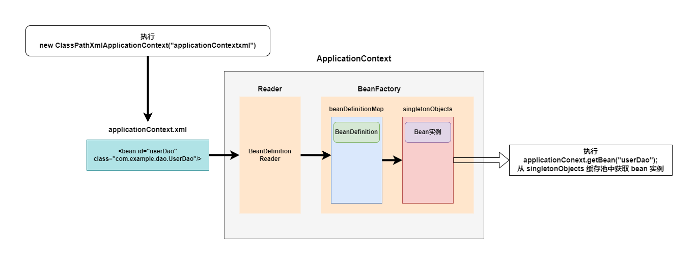
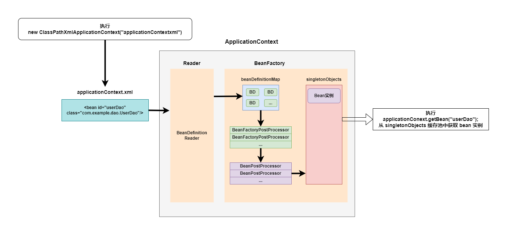
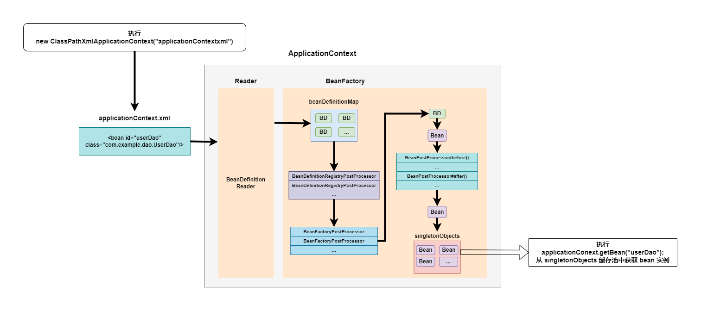
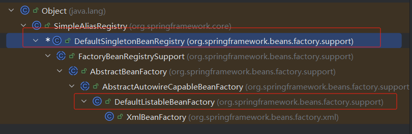
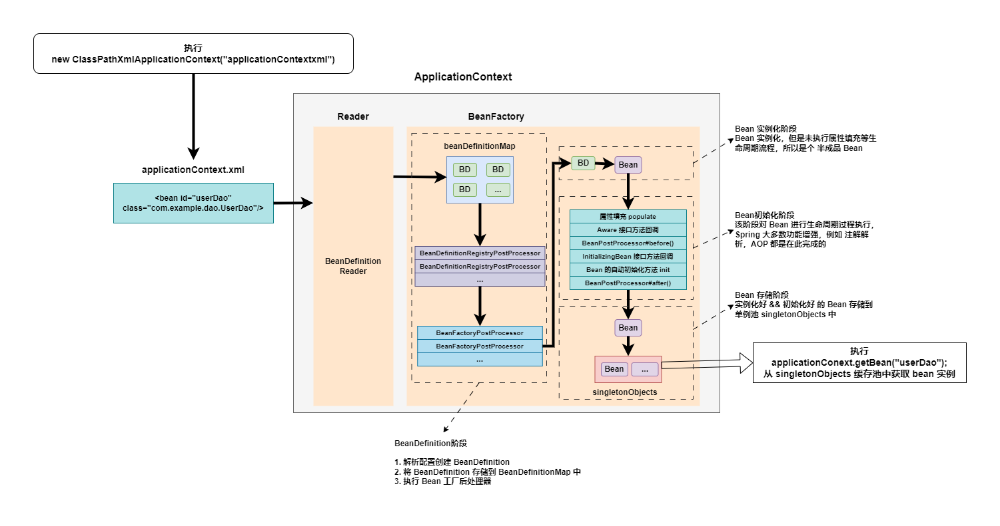

[toc]

# Spring Bean 实例化

## Spring Bean 从 <bean> 到 bean 实例的过程

Spring 容器在进行初始化时，会将 xml 配置的 `<bean>` 的信息封装成一个 `BeanDefinition` 对象，所有的 `BeanDefinition` 对象会被存储到一个 `BeanFactory` 下的 `beanDefinitionMap` 的映射表中，Spring 框架再对 `beanDefinitionMap` 遍历，使用反射创建 `Bean` 实例对象，创建的 `Bean` 实例对象会被存储到 `singletonObjects` 缓存池中，后续通过 Spring 容器 `getBean()` 获取 bean 实例时，就会从 `singletonObjects` 缓存池中查询并返回 bean。

> step1 定义 spring bean 信息

```xml
<bean id="userDao" class="com.example.dao.UserDao"/>
```

> step2 封装 bean 信息到 `BeanDefinition` 对象中

```java
public interface BeanDefinition extends AttributeAccessor, BeanMetadataElement {
    void setScope(@Nullable String var1);
    void setScope(@Nullable String var1);
    ...
}
```

> step3 存储 `BeanDefinition` 对象到 `beanDefinitionMap` 中

```java
public class DefaultListableBeanFactory extends AbstractAutowireCapableBeanFactory implements ConfigurableListableBeanFactory, BeanDefinitionRegistry, Serializable {
    ...
    // 存储 <bean> 标签对应的 BeanDefinition 对象
    // key: <bean> 标签对应 bean 的 beanName
    // value: <bean> 标签对应的 BeanDefinition 对象
    private final Map<String, BeanDefinition> beanDefinitionMap;
    ...
}
```

> step4 Spring 框架解析 `beanDefinitionMap` 中的数据，通过反射创建 bean 存储到 `singletonObjects` 单例池中

```java
public class DefaultSingletonBeanRegistry extends SimpleAliasRegistry implements SingletonBeanRegistry {
    ...
    // 存储 bean 实例的单例对象
    // key: bean 对应的 beanName
    // value: bean 实例对象
    private final Map<String, Object> singletonObjects = new ConcurrentHashMap(256);
    ...
}
```



## Spring 的后处理器

Spring 的后处理器允许我们介入到 `Bean` 的实例化过程中，达到 动态添加 `BeanDefinition`、动态修改 `BeanDefinition`、以及动态修改 `Bean` 的作用。Spring 的后处理器主要有以下两种:

1. `BeanFactoryPostProcessor`: Bean 工厂后处理器，在 `beanDefinitionMap` 且在 `Bean` 实例化之前执行;
2. `BeanPostProcessor`: Bean 后处理器，一般在 Bean 实例化后，在填充到 `singletonObjects` 之前执行;

Spring 后处理器执行时机如图所示



### `BeanFactoryPostProcessor` Bean 工厂后处理器

`BeanFactoryPostProcessor` 是一个接口规范，实现了该接口的类只要注册到 Spring 容器中，Spring 就会在对应的时机回调该接口的方法。

```java
// BeanFactoryPostProcessor 接口定义
public interface BeanFactoryPostProcessor {
    void postProcessBeanFactory(ConfigurableListableBeanFactory var1) throws BeansException;
}
```

> step1 创建自定义的 Bean 工厂后处理器

```java
public class MyBeanFactoryPostProcessor implements BeanFactoryPostProcessor {
    @Override
    public void postProcessBeanFactory(ConfigurableListableBeanFactory configurableListableBeanFactory) throws BeansException {
        System.out.println("MyBeanFactoryPostProcessor: postProcessBeanFactory()");
    }
}
```

> step2 注册 Bean 工厂后处理器

```xml
<!-- 注册 Bean工厂后处理器 -->
<bean class="com.example.processor.MyBeanFactoryPostProcessor"/>
```

> step3 启动 spring 容器

```java
new ClassPathXmlApplicationContext("applicationContext.xml");

// 输出
/*
MyBeanFactoryPostProcessor: postProcessBeanFactory()
*/
```

可以看到，spring 容器启动过程中，执行了自定义 bean工厂后处理器的回调函数。

#### 修改 BeanDefinition 对象

> step1 在 `MyBeanFactoryPostProcessor` 中，将 `userDao` 的 Bean 对象修改为 `UserDaoV2`

```java
public class MyBeanFactoryPostProcessor implements BeanFactoryPostProcessor {
    @Override
    public void postProcessBeanFactory(ConfigurableListableBeanFactory configurableListableBeanFactory) throws BeansException {
        System.out.println("MyBeanFactoryPostProcessor: postProcessBeanFactory()");
        // 获取 id 为 userDao 的 BeanDefinition 对象
        BeanDefinition userDaoBeanDefinition = configurableListableBeanFactory.getBeanDefinition("userDao");
        // 修改 userDao 的 class 为 V2 版本
        userDaoBeanDefinition.setBeanClassName("com.example.dao.UserDaoV2");
    }
}
```

> step2 spring 容器中获取名为 `userDao` 的实例

```java
ApplicationContext applicationContext = new ClassPathXmlApplicationContext("applicationContext.xml");
UserDao userDao = applicationContext.getBean(UserDao.class);
System.out.println("ApplicationContextCaseTest: userDao = " + userDao);

// 输出:
/*
MyBeanFactoryPostProcessor: postProcessBeanFactory()
// 可以看到，userDao 返回的实例对象变成了 UserDaoV2 类型
ApplicationContextCaseTest: userDao = com.example.dao.UserDaoV2@ae13544
*/
```

#### 动态注册 `BeanDefinition` 对象

> step1 创建目标 bean 类

注意: 无需将 BookDao 类注册到 `applicationContext.xml` 文件中

```java
package com.example.dao;

public class BookDao { }
```

> step2 新增自定义 `BeanFactoryPostProcessor` Bean工厂后处理器类

自定义 Bean 工厂后处理器类实现 `BeanFactoryRegistryPostProcessor` 接口，在 `postProcessBeanDefinitionRegistry` 回调函数中动态注册 `BookDao` 的 `BeanDefinition` 类。

```java
public class DynamicRegisterBeanFactoryPostProcessor implements BeanDefinitionRegistryPostProcessor {
    @Override
    public void postProcessBeanDefinitionRegistry(BeanDefinitionRegistry beanDefinitionRegistry) throws BeansException {
        System.out.println("DynamicRegisterBeanFactoryPostProcessor: postProcessBeanDefinitionRegistry()");
        // 动态注册 bookDao Bean
        BeanDefinition beanDefinition = new GenericBeanDefinition();
        beanDefinition.setBeanClassName("com.example.dao.BookDao");
        beanDefinitionRegistry.registerBeanDefinition("bookDao", beanDefinition);
        System.out.println("DynamicRegisterBeanFactoryPostProcessor: postProcessBeanDefinitionRegistry() register bookDao done.");
    }

    @Override
    public void postProcessBeanFactory(ConfigurableListableBeanFactory configurableListableBeanFactory) throws BeansException {
        System.out.println("DynamicRegisterBeanFactoryPostProcessor: postProcessBeanFactory()");
    }
}
```

> step3 向 spring 中注册自定义后处理器

```xml
<!-- 注册 Bean工厂后处理器 -->
<bean class="com.example.processor.DynamicRegisterBeanFactoryPostProcessor"/>
```

> step4 通过 spring 容器获取 `BookDao` bean 实例

```java
ApplicationContext applicationContext = new ClassPathXmlApplicationContext("applicationContext.xml");
BookDao bookDao = (BookDao) applicationContext.getBean("bookDao");
System.out.println("ApplicationContextCaseTest: bookDao = " + bookDao);

// 输出:
/*
// spring 容器初始化
DynamicRegisterBeanFactoryPostProcessor: postProcessBeanDefinitionRegistry()
DynamicRegisterBeanFactoryPostProcessor: postProcessBeanDefinitionRegistry() register bookDao done.
DynamicRegisterBeanFactoryPostProcessor: postProcessBeanFactory()
// 通过 spring 容器获取 bookDao 实例
ApplicationContextCaseTest: bookDao = com.example.dao.BookDao@587e5365
*/
```

可以看到 `BookDao` 类没有在 `applicationContext.xml` 文件中注册，通过 bean 工厂后处理器动态注册后，spring 容器可以成功的获取到 `bookDao` 实例。


### `BeanPostProcessor` Bean 后处理器

Spring 的 Bean 被实例化后，到最终缓存到 `singletonObjects` 单例池之前，中间会经过 bean 的初始化过程 ( 例如: 属性的填充，`init-method` 方法执行 )，spring 提供了一个对外进行扩展的点 `BeanPostProcessor` 称之为 Bean 后处理器。

自定义 spring bean 后处理器需要实现 `BeanPostProcessor` 接口，然后将实现类在 spring 中进行注册，spring 框架会自动识别并在对应的时机回调接口函数。

```java
public interface BeanPostProcessor {
    @Nullable
    default Object postProcessBeforeInitialization(Object bean, String beanName) throws BeansException {
        // 在 bean 的属性注入完毕，init-method 函数执行之前回调
        return bean;
    }

    @Nullable
    default Object postProcessAfterInitialization(Object bean, String beanName) throws BeansException {
        // 在 init-method 函数执行完毕，bean 添加到 singletonObjects 单例池之前执行
        return bean;
    }
}
```


> step1 创建自定义 bean 类

```java
public class UserDao {
    public UserDao() {
        System.out.println("UserDao: constructor");
    }

    public void initializer() {
        System.out.println("UserDao: initializer()");
    }

    public void setName(String name) {
        System.out.println("UserDao: setName() name=" + name);
    }
}
```

> step2 注册自定义 bean

```xml
<!-- 增加 init-method 函数配置 -->
<bean id="userDao" class="com.example.dao.UserDao" init-method="initializer">
    <property name="name" value="aaa"/>
</bean>
```

> step3 创建 bean 后处理器类

```java
public class MyBeanPostProcessor implements BeanPostProcessor {
    @Override
    public Object postProcessBeforeInitialization(Object bean, String beanName) throws BeansException {
        System.out.println("MyBeanPostProcessor: postProcessBeforeInitialization() bean=" + bean);
        // 在 bean 实例化，且属性注入完毕后， init-method 函数执行之前 回调
        return bean;
    }

    @Override
    public Object postProcessAfterInitialization(Object bean, String beanName) throws BeansException {
        System.out.println("MyBeanPostProcessor: postProcessAfterInitialization() bean=" + bean);
        // 在 init-method 函数执行完毕之后，bean 实例添加到 singletonObjects 单例池之前 回调
        return bean;
    }
}
```

> step4 注册 bean 后处理器类

```xml
<!-- 注册 Bean后处理器 -->
<bean class="com.example.processor.MyBeanPostProcessor"/>
```

> step5 启动 spring 容器

```java
new ClassPathXmlApplicationContext("applicationContext.xml");

// 输出
/*
UserDao: constructor
UserDao: setName() name=aaa
// 1. 在 userDao 对象创建 && 属性注入完毕后执行 bean 后处理器 postProcessBeforeInitialization() 函数
// 注意: 这里是在每个 bean 实例化并注入属性后执行 postProcessBeforeInitialization()，而不是所有 bean 创建完毕后同意执行回调
MyBeanPostProcessor: postProcessBeforeInitialization() bean=com.example.dao.UserDaoV2@68e965f5
// 2. 在 bean 后处理器 postProcessBeforeInitialization() 执行完毕后执行 init-method 函数
UserDao: initializer()
// 3. 在 init-method 函数执行完毕后回调 postProcessAfterInitialization() 函数 
MyBeanPostProcessor: postProcessAfterInitialization() bean=com.example.dao.UserDaoV2@68e965f5
*/
```

spring bean工厂后处理器和bean后处理器处理时机完整流程如下所示




# Spring Bean 的生命周期

Spring Bean 的生命周期是从 Bean 实例化之后 ( 即通过反射创建出对象之后 )，到 Bean 成为一个完整对象，最终存储到单例池 ( `singletonObjects` ) 中，这个过程被称之为 Spring Bean 的生命周期。Spring Bean 的生命周期大体上分为三个阶段:

1. Bean 的实例化阶段: Spring 框架取出 `BeanDefinition` 的信息判断当前 `Bean` 的范围是否是 `singleton` 的，是否是延迟加载的，是否是 FactoryBean 等，最终会将一个 `singleton` 的 Bean 通过反射进行实例化。
2. Bean 的初始化阶段: Bean 创建之后还仅仅是个 "半成品"，spring 框架还需要对 Bean 实例的属性进行注入，执行一些 Aware 接口方法，执行 `BeanPostProcessor` 方法，执行 `InitializingBean` 接口的 初始化方法，执行自定义初始化init方法等。该阶段是 Spring 最具技术含量和复杂度的阶段。
3. Bean 的完成阶段: 经过初始化阶段，Bean 就成为了一个完整的 Spring Bean，随后被存储到 单例池 ( `singletonObjects` ) 中，随即完成了 Spring Bean 的整个生命周期。


## Spring Bean 的初始化阶段

Spring Bean 的初始化过程涉及如下几个过程:

- Bean 实例的属性填充;
- Aware 接口属性注入;
- BeanPostProcessor 的 before() 方法执行;
- InitializingBean 接口的初始化方法回调;
- 自定义初始化方法 init 回调;
- BeanPostProcessor 的 after() 方法执行;

```text
// bean 生命周期日志

// step1: 执行 Bean工厂后处理器
DynamicRegisterBeanFactoryPostProcessor: postProcessBeanDefinitionRegistry()
DynamicRegisterBeanFactoryPostProcessor: postProcessBeanFactory()
MyBeanFactoryPostProcessor: postProcessBeanFactory()

// step2: 开始 Bean 实例创建
PersonDao: constructor
// step3: 注入 bean 的属性
PersonDao: setName(), name=zhangsan
// step4: 执行 BeanPostProcessor#berore() 方法
MyBeanPostProcessor: postProcessBeforeInitialization() bean=com.example.dao.PersonDao@7e9131d5
// step5: 执行 InitializingBean 接口回调方法
PersonDao: afterPropertiesSet()
// step6: 执行自定义 init-method 方法回调
PersonDao: init()
// step7: 执行 BeanPostProcessor#after() 方法
MyBeanPostProcessor: postProcessAfterInitialization() bean=com.example.dao.PersonDao@7e9131d5
// step8: bean 实例存储到单例池 singletonObjects 中，done.
```


### Bean 实例属性填充

Spring 在进行属性注入时有如下几种情况:

- 注入普通属性, String, int 或 存储基本数据类型集合时，直接通过 set 方法的反射设置进去;
- 注入单向对象引用属性时，从容器中 `getBean()` 获取 Bean 对象，然后通过 set 方法反射设置进去，如果容器中还未创建目标 bean 对象，则会先创建 被注入对象 bean 实例 ( 执行完被注入对象完整生命周期后 )，再进行注入操作;
- 注入双向对象引用属性时，涉及了循环引用 ( 循环依赖 ) 问题;

#### 注入单项对象引用属性案例

> step1 定义 BookDao 和 BookService 类，BookService 持有 BookDao 对象

// BookDao
```java
public class BookDao {
    public BookDao() {
        System.out.println("BookDao: constructor");
    }
}
```

// BookService
```java
public class BookService {

    private BookDao bookDao;

    public BookService() {
        System.out.println("BookService: constructor");
    }
    
    public void setBookDao(BookDao bookDao) {
        this.bookDao = bookDao;
        System.out.println("BookService: setBookDao() bookDao=" + bookDao);
    }
}
```

> step2 将 BookDao 和 BookService 配置到 Spring 框架

Spring 框架按照顺序解析 xml 配置信息

- bookDao 配置在 bookService 上方，此时 spring 向 bookService 注入 bookDao 属性时，getBean() 能够获取到 bookDao，直接注入即可;
- bookService 配置 在 bookDao 上方，此时 spring 向 bookService 注入 bookDao 属性时，Spring 框架还未创建 bookDao 实例，此时 spring 框架会先创建 bookDao ( 执行完 bookDao 的完整生命周期 ) 实例，然后回过来向 bookService 注入 bookDao 实例; ( 主要分析过程 )

```xml
<!--
    配置BookService
    需要将 bookService 配置定义在 bookDao 之前，Spring 框架按照顺序解析配置
    此时，bookService 注入 bookDao 属性时，bookDao 还未创建，用以验证单项引用依赖加载属性注入
-->
<bean id="bookService" class="com.example.service.BookService">
    <property name="bookDao" value="bookDaoInject"/>
</bean>
<bean id="bookDaoInject" class="com.example.dao.BookDao"/>

<!-- bookService 配置在 bookDao 之后 -->
<!--<bean id="bookDaoInject" class="com.example.dao.BookDao"/>-->
<!--<bean id="bookService" class="com.example.service.BookService">-->
<!--    <property name="bookDao" value="bookDaoInject"/>-->
<!--</bean>-->
```

> step3 启动 spring 容器

```java
new ClassPathXmlApplicationContext("applicationContext.xml");
```

- bookService 配置在 bookDao 之后，得到如下日志

```text
// step1: spring 容器构造 BookDao 实例
BookDao: constructor
// step2: spring 容器初始化 bookDao 实例
MyBeanPostProcessor: postProcessBeforeInitialization() bean=com.example.dao.BookDao@152aa092
MyBeanPostProcessor: postProcessAfterInitialization() bean=com.example.dao.BookDao@152aa092
// step3: spring 容器构造 BookService 实例
BookService: constructor
// step4: 此时，由于容器已经初始化完成 bookDao 实例，此时直接 通过 getBean() 获取的 bookDao 向 bookService 注入
BookService: setBookDao() bookDao=com.example.dao.BookDao@152aa092
// step5: bookService 属性注入完成后，继续执行初始化操作
MyBeanPostProcessor: postProcessBeforeInitialization() bean=com.example.service.BookService@37858383
MyBeanPostProcessor: postProcessAfterInitialization() bean=com.example.service.BookService@37858383
// step6: spring 容器启动完成，done.
```

- bookService 配置在 bookDao 之前，得到如下日志

```text
// step1: spring 容器构造 BookService 实例
BookService: constructor
// step2: spring 容器向 bookService 注入 bookDao 时，bookDao 还未创建，此时先创建 bookDao 实例
BookDao: constructor
// step3: bookDao 实例创建后，先进行 bookDao 实例的初始化流程，执行 bean后处理器，放入到 singletonObjects 单例池
MyBeanPostProcessor: postProcessBeforeInitialization() bean=com.example.dao.BookDao@152aa092
MyBeanPostProcessor: postProcessAfterInitialization() bean=com.example.dao.BookDao@152aa092
// step4: bookDao 实例初始化完成后，再执行 bookService 的注入操作
BookService: setBookDao() bookDao=com.example.dao.BookDao@152aa092
// step5: bookService 属性注入完成后，继续执行初始化操作
MyBeanPostProcessor: postProcessBeforeInitialization() bean=com.example.service.BookService@37858383
MyBeanPostProcessor: postProcessAfterInitialization() bean=com.example.service.BookService@37858383
// step6: spring 容器启动完成，done.
```


#### 注入双向对象引用属性案例 (循环依赖)

多个实例之间相互依赖并形成闭环的情况称之为 循环依赖。

> step1: 创建双向依赖的类

// Student
```java
public class Student {
    public Student() {
        System.out.println("Student: Constructor");
    }

    // Student 依赖 Classroom 实例
    public void setClassroom(Classroom classroom) {
        System.out.println("Student: setClassroom(): classroom=" + classroom);
    }
}
```

// Classroom
```java
public class Classroom {
    public Classroom() {
        System.out.println("Classroom: constructor");
    }

    // Classroom 依赖 Student 实例
    public void setStudent(Student student) {
        System.out.println("Classroom: setStudent(), student=" + student);
    }
}
```

> step2: 向 Spring 中注册 Student 和 Classroom

```xml
<!-- 配置 Student 和 Classroom 信息，两个实例相互依赖 -->
<bean id="student" class="com.example.domain.Student">
    <property name="classroom" ref="classroom"/>
</bean>
<bean id="classroom" class="com.example.domain.Classroom">
    <property name="student" ref="student"/>
</bean>
```

> step3: 启动 spring 容器

```java
new ClassPathXmlApplicationContext("applicationContext.xml");
```

得到如下日志:

```text
// step1: spring 容器 创建 Student 实例
Student: Constructor
// step2: spring 容器 向 student 实例注入 classroom 实例时，发现还未创建 classroom 实例，因此先创建 classroom 实例
Classroom: constructor
// step3: classroom 创建完成后优先执行属性注入和初始化操作，这里向其内部注入 student 实例。
// 注意，这里的 student 实例是刚创建还未初始化完成的，因此 该实例还未存储到 singletonObjects 单例池中
Classroom: setStudent(), student=com.example.domain.Student@2beee7ff
// step4: 执行 classroom 实例的初始化操作
MyBeanPostProcessor: postProcessBeforeInitialization() bean=com.example.domain.Classroom@5136d012
MyBeanPostProcessor: postProcessAfterInitialization() bean=com.example.domain.Classroom@5136d012
// step5: classroom 实例初始化完成后，再回头执行 student 实例的属性注入和初始化操作
Student: setClassroom(): classroom=com.example.domain.Classroom@5136d012
MyBeanPostProcessor: postProcessBeforeInitialization() bean=com.example.domain.Student@2beee7ff
MyBeanPostProcessor: postProcessAfterInitialization() bean=com.example.domain.Student@2beee7ff
// step6: spring 容器启动完成，done.
```

#### spring 的三级缓存分析循环引用问题

spring 提供了三级缓存来解决循环依赖问题，三级缓存分别用于存储 完整bean实例 和 半成品bean实例。

- 完整bean实例: 创建完成的bean实例，且完成属性注入和初始化操作的 bean，此时 bean 存储在 `singletonObjects` 单例池中;
- 半成品bean实例: 创建完成的bean实例，还未完成属性注入和初始化操作的 bean。

spring 提供的三级换内存map定义 `DefaultListableBeanFactory` 的父类之上， `DefaultSingletonBeanRegistry` 类中



```java
public class DefaultSingletonBeanRegistry extends SimpleAliasRegistry implements SingletonBeanRegistry {
    // 1. 一级缓存: 最终存储单例 Bean 实例 (完整实例) 的容器，即缓存实例化和初始化都完成的 bean 实例;
    private final Map<String, Object> singletonObjects = new ConcurrentHashMap(256);
    // 2. 二级缓存: 早期 Bean 单例池，缓存半成品实例，且 当前 bean 实例已经被其它对象引用了 ( 例如 userDao 被注入到 userService 实例中 );
    private final Map<String, Object> earlySingletonObjects = new ConcurrentHashMap(16);
    // 3. 三级缓存: 单例 Bean 的工厂池，缓存半成品实例，当前 bean 实例还未被引用
    private final Map<String, ObjectFactory<?>> singletonFactories = new HashMap(16);
}
```

```java
// 三级缓存存储的 value 对象
package org.springframework.beans.factory;

import org.springframework.beans.BeansException;

@FunctionalInterface
public interface ObjectFactory<T> {
    T getObject() throws BeansException;
}
```

> student 实例和 classroom 实例循环依赖过程结合三级缓存分析

注意: 三级缓存的查找顺序为 先查找 一级缓存，没有命中目标再查找 二级缓存，没有命中目标最后查找三级缓存。任意一级缓存命中目标就会返回。

1. `Student` 实例化对象，还未初始化，此时，`student` 实例存储到三级缓存 `singletonFactories` 缓存池中。
2. `student` 注入 `classroom` 属性，spring 框架从缓存中获取 `classroom` 实例，此时 spring 缓存中还未创建 `classroom` 实例;
3. `Classroom` 实例化对象，还未初始化，此时，`classroom` 实例存储到三级缓存 `singletonFactories` 缓存池中。// 当前缓存池中缓存了两个bean
4. `classroom` 注入 `student` 属性，`student` 实例在三级缓存命中，被注入到 `classroom` 中，随后 `student` 实例从 三级缓存 移入到 二级缓存中 (三级缓存中的 `student` 会被删除)。
5. `classroom` 完成属性注入，进而执行初始化操作，最终成为一个完整 bean，随后，随后 `classroom` 实例被存储到 一级缓存 中，二级三级缓存中的 `classroom` 实例将会被移除。
6. `student` 继续执行注入 `classroom` 属性操作。
7. `student` 继续完成其它实例注入，在初始化完成后，`student` 实例被缓存到 一级缓存 中，二级三级缓存中的 `student` 实例将会被移除;





