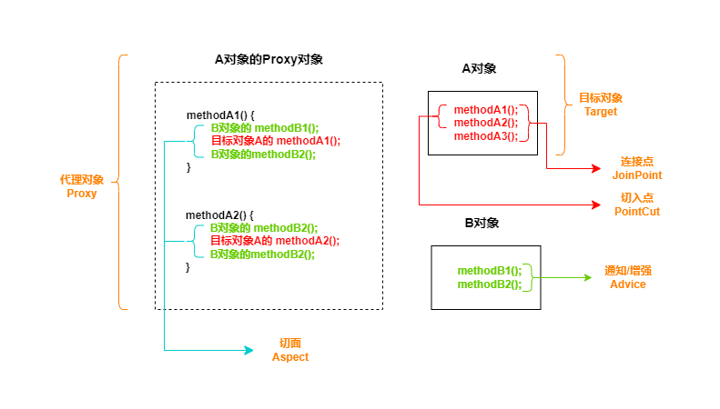
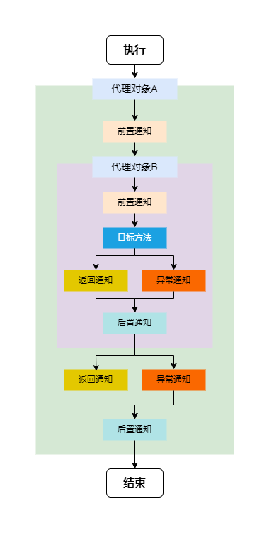

spring aop

# spring aop

`AOP`( `Aspect Oriented Programming` )，面向切面编程，是对面向对象编程 (`OOP`) 的升华。`OOP`
是纵向对一个事务的抽象，一个对象包含静态的属性信息以及动态的方法信息等。`AOP` 则是横向的对不同事物的抽象，属性与属性，方法与方法，对象与对象都可以组成一个切面。

`AOP` 思想通过 动态代理技术，在运行期间，对目标对象的方法进行增强，代理对象同名方法内可以执行原有逻辑的同时嵌入执行其它增强逻辑或其它对象的方法。

`AOP` 中的相关概念

| 概念    | 名词          | 解释                       |
|-------|-------------|--------------------------|
| 目标对象  | `Target`    | 被增强方法所在的对象               |
| 代理对象  | `Proxy`     | 对目标对象进行增强后的对象，客户端实际调用的对象 |
| 连接点   | `JoinPoint` | 目标对象中可以被增强的方法            |
| 切入点   | `PointCut`  | 目标对象中实际被增强的方法            |
| 通知/增强 | `Advice`    | 增强部分的代码逻辑                |
| 切面    | `Aspect`    | 增强和切入点的组合                |
| 织入    | `Weaving`   | 将通知和切入点组合动态组合的过程         |



## AOP 中的通知

aop 中的通知包含如下类型

| 类型   | 解释                                                                                                         |
|------|------------------------------------------------------------------------------------------------------------|
| 前置通知 | 使用 `@Before()` 注解或 配置文件中使用 `<aop:before />` 标签，在被代理的目标方法前执行                                                |
| 返回通知 | 使用 `@AfterReturning` 注解或 配置文件中使用 `<aop:after-returning />` 标签，在被代理的目标方法**成功结束后**执行 (可以理解为 `try` 代码块中的最后一行) |
| 异常通知 | 使用 `@AfterThrowing` 注解或 配置文件中使用 `<aop:after-throwing />` 标签，在被代理的目标方法**异常结束后**执行 (可以理解为 `catch` 代码块中执行)    |
| 后置通知 | 使用 `@After` 注解或 配置文件中使用 `<aop:after />` 标签，在被代理的目标方法最终执行结束后执行 (可以理解为 `finally` 代码块中执行)                     |
| 环绕通知 | 使用 `@Around` 注解或 配置文件中使用 `<aop:around />` 标签，使用 `try-catch-finally` 结构围绕整个被代理的目标方法，包含上述四种通知对应的所有位置         |

> 各种通知执行的顺序

- spring 版本 `5.3.x` 以前:
    1. 前置通知
    2. 目标操作
    3. 后置通知
    4. 返回通知或异常通知
- spring 版本 `5.3.x` 以后:
    1. 前置通知
    2. 目标操作
    3. 返回通知或异常通知
    4. 后置通知

```java
public int add(int a, int b) {
    int result;
    try {
        System.out.println("前置通知");
        result = a + b;
        System.out.println("返回通知");
    } catch (Exception e) {
        e.printStackTrace();
        System.out.println("异常通知");
    } finally {
        System.out.println("后置通知");
    }
    return result;
}
```

## 切点表达式

切点表达式是配置要对哪些连接点 ( 哪些类的哪些方法 ) 进行通知的增强，语法如下:

```text
execution([访问修饰符] 返回值类型 包名.类名.方法名(参数))
```

其中

- 访问修饰符可以省略不写
- 返回值类型、某一级包名、类名、方法名 可以使用 `*` 表示任意
- 包名与类名之间使用单点 `.` 表示该包下的类，使用双点 `..` 表示该包及其子包下的类;
- 参数列表可以使用两个点 `..` 表示任意参数

例如:

```java
package com.example.service.impl;

public class UserServiceImpl {

    public void login(String username, String password) {
        // do nothing
    }
}
```

使用切点表达式配置 `login` 方法时

```text
// 配置 login 方法
execution(public void com.example.service.impl.UserServiceImpl.login(String, String))

// 配置 UserServiceImpl 类下的所有方法
// * 表示任意方法
// .. 表示任意参数
execution(public void com.example.service.impl.UserServiceImpl.*(..))
```

## AOP通知方法参数

通知方法在被调用时，Spring 可以为其传递一些必要的参数

| 参数类型                  | 作用                                                 |
|-----------------------|----------------------------------------------------|
| `JoinPoint`           | 连接点对象，任何通知都可以使用，可以获得当前目标对象、目标方法参数等信息。              |
| `ProceedingJoinPoint` | `JoinPoint` 子类对象，主要是在环绕通知中执行 `proceed()`，进而执行目标方法。 |
| `Throwable`           | 异常对象，在使用异常通知中，需要在配置文件中指出异常对象名称。                    |

# 基于 xml 配置文件的aop

xml 方式配置 AOP 的步骤

1. 导入 AOP 相关坐标;
2. 准备目标类、增强类，并配置给 Spring 管理;
3. 配置切点表达式 ( 哪些方法要被增强 );
4. 配置织入 ( 切点被哪些通知方法增强，包括前置，后置等 )

> step1: 导入 AOP 相关坐标

`spring-context` 包已经包含了 `spring-aop` 坐标，因此无需额外导入 `spring-aop` 包;

```xml
<!-- 导入 aop 相关坐标 -->
<dependency>
    <groupId>org.springframework</groupId>
    <artifactId>spring-aspects</artifactId>
    <version>5.3.24</version>
</dependency>
```

> step2: 创建目标类和切面类，并配置到spring容器中

```java
public class UserServiceImpl implements UserService {
    @Override
    public void login(String username, String password) {
        System.out.println("UserServiceImpl: login(), username=" + username + ", password=" + password);
    }

    @Override
    public void show() {
        System.out.println("UserServiceImpl: show()");
    }
}
```

```java
public class LoggerAspect {
    public void beforeAdvice() {
        System.out.println("LogAdvice: beforeAdvice()");
    }

    public void afterReturningAdvice() {
        System.out.println("LogAdvice: afterReturningAdvice()");
    }

    public void afterAdvice() {
        System.out.println("LogAdvice: afterAdvice()");
    }
}
```

> step3: 配置切点表达式

// applicationContext.xml

```xml
<?xml version="1.0" encoding="UTF-8"?>
<beans xmlns="http://www.springframework.org/schema/beans"
       xmlns:xsi="http://www.w3.org/2001/XMLSchema-instance"
       xmlns:aop="http://www.springframework.org/schema/aop"
       xsi:schemaLocation="
            http://www.springframework.org/schema/beans http://www.springframework.org/schema/beans/spring-beans.xsd
            http://www.springframework.org/schema/aop http://www.springframework.org/schema/aop/spring-aop.xsd
        ">

    <!--
        需要导入aop的命名空间 xmlns:aop="http://www.springframework.org/schema/aop"
    -->

    <!-- 配置目标类 -->
    <bean id="userService" class="com.example.service.impl.UserServiceImpl"/>
    <!-- 配置切面类 -->
    <bean id="loggerAspect" class="com.example.aspect.LoggerAspect"/>

    <!-- aop配置 -->
    <aop:config>
        <!-- 配置通用的切点表达式，声明哪些方法需要被增强 -->
        <aop:pointcut id="userServiceLoginPointCut"
                      expression="execution(public void com.example.service.impl.UserServiceImpl.login(String, String))"/>
        <!-- 配置织入，目的是组合切点和通知 -->
        <aop:aspect ref="loggerAspect">
            <!-- 配置前置通知 -->
            <aop:before method="beforeAdvice"
                        pointcut="execution(public void com.example.service.impl.UserServiceImpl.login(String, String))"/>
            <!-- 配置返回通知 -->
            <aop:after-returning method="afterReturningAdvice" pointcut-ref="userServiceLoginPointCut"/>
            <!-- 配置后置通知 -->
            <aop:after method="afterAdvice" pointcut-ref="userServiceLoginPointCut"/>
        </aop:aspect>
    </aop:config>

</beans>
```

> step4: 获取代理对象，执行

```java
ApplicationContext context = new ClassPathXmlApplicationContext("applicationContext.xml");
// 使用被代理对象的接口类型获取代理对象
UserService userServiceProxy = context.getBean(UserService.class);
userServiceProxy.

login("zhangsan","123");

// 输出:
/*
LogAdvice: beforeAdvice(), methodName=login, args=[zhangsan, 123]
UserServiceImpl: login(), username=zhangsan, password=123
LogAdvice: afterReturningAdvice()
LogAdvice: afterAdvice()
*/
```

# 基于注解配置的aop

AOP 的底层原理

1. Spring 会为每个被切面切入的组件创建代理对象 ( Spring CGLIB 创建的代理对象，无需接口实现要求 );
2. 代理对象中保存了切面类里面所有通知方法构成的增强器链;
3. 目标方法执行时，会先去执行增强器链中需要执行的通知方法;

AOP中方法的执行顺序:

`前置通知 -> 目标方法 -> 返回通知/异常通知 -> 后置通知` ;

## `JoinPoint` 连接点，获取目标方法信息

`JoinPoint` 连接点对象，包装了当前目标方法的所有信息;

```java

@Before("execution(int *(int, int))")
public void excBefore(JoinPoint joinPoint) {
    // 获取方法签名
    Signature signature = joinPoint.getSignature();
    // 获取目标方法名称
    String methodName = signature.getName();
    // 获取目标方法参数
    Object[] args = joinPoint.getArgs();
    System.out.println("LogAspect: excBefore(), methodName=" + methodName + ", args=" + Arrays.toString(args));
}
```

## `@AfterReturning` 返回通知获取目标方法返回值

```java
/**
 * 返回通知
 *
 * @param joinPoint 连接点对象
 * @param result    配置返回值的参数名称
 */
@AfterReturning(value = "execution(int *(int, int))", returning = "result")
public void excReturn(JoinPoint joinPoint, Object result) {
    // 获取目标方法签名
    MethodSignature signature = (MethodSignature) joinPoint.getSignature();
    // 获取方法名称
    String methodName = signature.getName();
    // 获取方法参数
    Object[] args = joinPoint.getArgs();
    System.out.println("LogAspect: excReturn(), methodName=" + methodName + ", args=" + Arrays.toString(args) + ", result=" + result);
}
```

## `@AfterThrowing` 异常通知获取异常信息

```java
/**
 * 异常通知
 *
 * @param joinPoint 连接点对象
 * @param tx        配置异常通知获取异常信息
 */
@AfterThrowing(value = "execution(int *(int, int))", throwing = "tx")
public void excException(JoinPoint joinPoint, Throwable tx) {
    // 获取目标方法签名
    MethodSignature signature = (MethodSignature) joinPoint.getSignature();
    // 获取方法名称
    String methodName = signature.getName();
    // 获取方法参数
    Object[] args = joinPoint.getArgs();
    System.out.println("LogAspect: excException(), methodName=" + methodName + ", args=" + Arrays.toString(args) + ", exception=" + tx);
}
```

## 切入点表达式抽取

```java
/**
 * 抽取切入点表达式
 */
@Pointcut("execution(int *(int, int))")
public void pointCut() {
    // do nothing
}

@Before("pointCut()")   // 使用切入点表达式
public void excBefore(JoinPoint joinPoint) {
    // 获取方法签名
    Signature signature = joinPoint.getSignature();
    // 获取目标方法名称
    String methodName = signature.getName();
    // 获取目标方法参数
    Object[] args = joinPoint.getArgs();
    System.out.println("LogAspect: excBefore(), methodName=" + methodName + ", args=" + Arrays.toString(args));
}
```

## `@Around` 环绕通知

```java
/**
 * 环绕通知
 *
 * @param joinPoint 连接点对象
 * @return result
 */
@Around(value = "com.example.cal.aspect.LogAspect.pointCut()")
public Object aroundAdvice(ProceedingJoinPoint joinPoint) {
    // 获取方法签名
    MethodSignature signature = (MethodSignature) joinPoint.getSignature();
    // 获取方法名称
    String methodName = signature.getName();
    // 获取方法参数
    Object[] args = joinPoint.getArgs();
    // 定义方法返回值
    Object result = null;
    try {
        System.out.println("AuthAspect: aroundAdvice() before, methodName=" + methodName + ", args=" + Arrays.toString(args));
        // 执行目标方法
        result = joinPoint.proceed();
        System.out.println("AuthAspect: aroundAdvice() afterReturning, methodName=" + methodName + ", result=" + result);
    } catch (Throwable e) {
        System.out.println("AuthAspect: aroundAdvice() afterThrowing, methodName=" + methodName + ", exception=" + e);
        e.printStackTrace();
    } finally {
        System.out.println("AuthAspect: aroundAdvice() after, methodName=" + methodName);
    }
    return result;
}
```

## 多切面执行顺

spring aop 配置多个切面时，可以使用 `@Order` 指定切面执行顺序，`@Order(1)` 中配置的至越小，切面优先执行;

1. 配置 `AuthAspect` 切面的优先级为1 `@Order(1)`;
2. `LogAspect` 切面的优先级为默认值 `Integer.MAX_VALUE`;

得到输出如下:

```text
// 认证的前置通知
AuthAspect: aroundAdvice() before, methodName=add, args=[1, 2]
// 日志的前置通知
LogAspect: excBefore(), methodName=add, args=[1, 2]
// 目标方法
CalculatorImpl: add(), result=3
// 日志的返回通知
LogAspect: excReturn(), methodName=add, args=[1, 2], result=3
// 日志的后置通知
LogAspect: excEnd()
// 认证的返回通知
AuthAspect: aroundAdvice() afterReturning, methodName=add, result=3
// 认证的后置通知
AuthAspect: aroundAdvice() after, methodName=add
```

多切面执行顺序逻辑参考下图



## spring aop 注解方式使用步骤

1. 导入 `AOP` 依赖
2. 编写切面 `Aspect`
3. 编写通知方法
4. 指定切入点表达式
5. 测试 `AOP` 动态织入

> step1: 导入 aop 坐标

```xml
<!-- 导入 aop 相关坐标 -->
<dependency>
    <groupId>org.springframework</groupId>
    <artifactId>spring-aspects</artifactId>
    <version>5.3.24</version>
</dependency>
```

> step2，step3，step4: 编写切面 `Aspect`，编写通知方法，指定切入点表达式

```java
/**
 * @Component 首先这个类要受spring 管理
 * @Aspect 注解告诉 spring 这个组件是个切面，注意：需要在 applicationContext.xml 配置文件中开启aop支持
 */
@Aspect
@Component
public class LogAspect {

    /*
        需要告诉 spring 以下通知何时何地运行？

        何时?
            @Before: 目标方法执行之前运行
            @AfterReturning: 目标方法正常执行结束返回结果时运行 (可以理解为try代码块的最后一行)
            @AfterThrowing: 目标方法抛出异常时运行 (可以理解为 catch 代码块里面执行)
            @After: 目标方法最终返回时运行 (可以理解为 finally 代码块)

        何地?
            切入点表达式: execution( 方法的全签名 )
                - 全签名完整写法:
                    public int com.example.cal.Calculator.add(int, int) throws Exception
                - 全签名省略写法: [] 中的内容可以省略
                    [public] int [com.example.cal.Calculator].add(int, int) [throws Exception]
                    int add(int, int)
                - 通配符
                    - *: 表示任意字符
                    - (..) 动态参数列表

        何时何地?
            @Before("execution(int add(int, int))")

     */

    @Before("execution(int *(int, int))")
    public void excBefore() {
        System.out.println("LogAspect: excBefore()");
    }

    @AfterReturning("execution(int *(int, int))")
    public void excReturn() {
        System.out.println("LogAspect: excReturn()");
    }

    @AfterThrowing("execution(int *(int, int))")
    public void excException() {
        System.out.println("LogAspect: excException()");
    }

    @After("execution(int *(int, int))")
    public void excEnd() {
        System.out.println("LogAspect: excEnd()");
    }

}
```

> step5: 测试

```java
ApplicationContext context = new ClassPathXmlApplicationContext("aopApplicationContext.xml");
Calculator bean = context.getBean(Calculator.class);
bean.

add(1,2);
```

# AOP 的使用场景

> 1. 日志记录

在不修改业务代码的场景下，为方法调用添加日志记录功能。有助于追踪方法调用的时间、参数、返回值以及异常信息等。

> 2. 事务管理

在服务层或数据访问层的方法上应用事务管理，确保数据的一致性和完整性。通过 AOP ，可以自动的为需要事务支持的方法添加事务开始、提交或回滚的逻辑。

> 3. 权限检查

> 4. 性能监控


